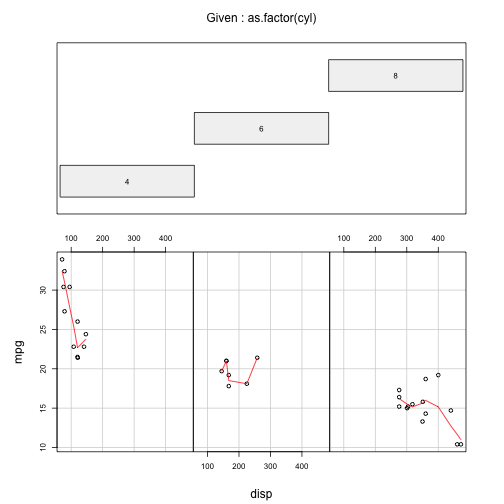

index.Rmd
mtcars 
segmentation visualizer
========================================================
author: Santiago Armida
date: February 28, 2016

Introduction
========================================================

The application is very simple.
It is based in an example code available in the Gallery section of the shinyapps.io page.
It has three inputs:

- First variable selection
- Second variable selection
- Number of clusters

It uses the mtcars file supplied with R.
The description of the file is as follows
 
The data was extracted from the 1974 Motor Trend US magazine, and comprises fuel consumption and 10 aspects of automobile design and performance for 32 automobiles (1973 and 74 models).

Firt rows: Slide With Code
========================================================


```r
head(mtcars)
```

```
                   mpg cyl disp  hp drat    wt  qsec vs am gear carb
Mazda RX4         21.0   6  160 110 3.90 2.620 16.46  0  1    4    4
Mazda RX4 Wag     21.0   6  160 110 3.90 2.875 17.02  0  1    4    4
Datsun 710        22.8   4  108  93 3.85 2.320 18.61  1  1    4    1
Hornet 4 Drive    21.4   6  258 110 3.08 3.215 19.44  1  0    3    1
Hornet Sportabout 18.7   8  360 175 3.15 3.440 17.02  0  0    3    2
Valiant           18.1   6  225 105 2.76 3.460 20.22  1  0    3    1
```

Slide With Plot
========================================================

 
Conclusion
========================================================

These are very powerfull tools to develop and deploy applications.
Although must of the development can be made in RStudio with R there are some additional thing that can be added. 
- HTML code
- Some additionals in internet page handling

As data is available for different intersts, many analysis can be performed to select and clean the data.

Then there are very powerfull analyticall tools that can be used to explore and use the data to get better results.
